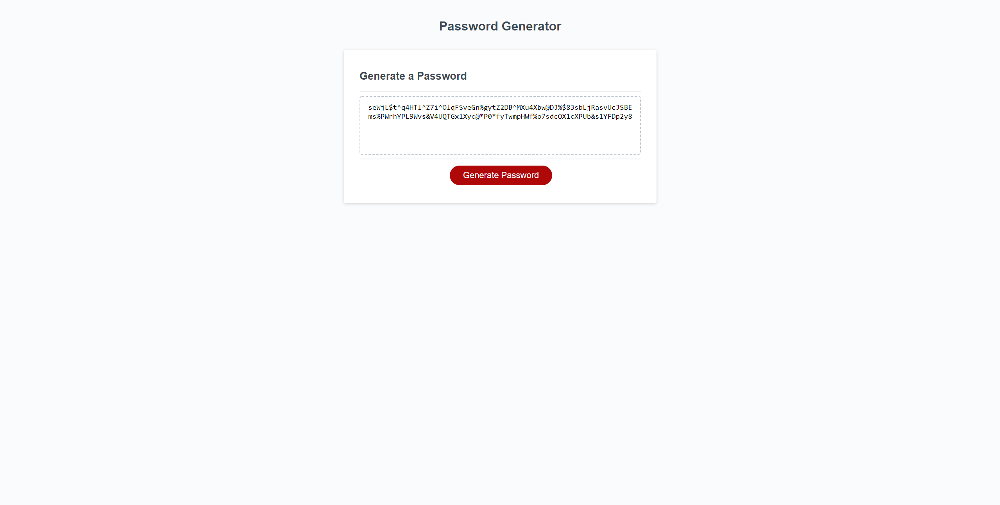

# Password Generator by Mason Morris

The objective of this assignment was to write the JavaScript for a simple password generator. To accomplish this I used my knowledge of the window object, arrays, concatenation, for loops, the Math object, and the Document Object Model.

[CLick here to view the deployed page!](https://masontmorris.github.io/password-generator/)
